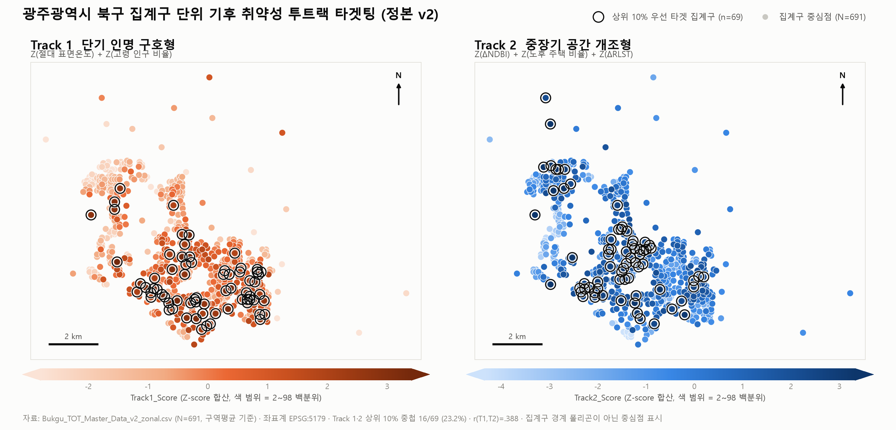

> **Fig. 2** 정본(v2) 점수 기준 Track 1·2 우선 타겟 집계구. `analysis/make_track_map.py`로 재생성할 수 있습니다. 저장소에 집계구 경계 폴리곤이 포함되어 있지 않아 중심점(centroid)으로 표시하였습니다.

# 🌡️ 광주광역시 북구 도심 열환경 및 다차원 기후 취약성 분석
(Urban Heat Environment and Climate Vulnerability Analysis in Buk-gu, Gwangju)

본 레포지토리는 구글 어스 엔진(Google Earth Engine, GEE) 기반의 다중위성 데이터와 통계청 미시 공간 데이터를 융합하여, 도심 열섬 현상(UHI)의 공간적 패턴을 분석하고 기후위기 적응 정책의 우선순위(투트랙 타겟팅)를 도출하기 위한 분석 코드 및 마스터 데이터를 제공합니다.

> **📌 2026-09-02 데이터 정본화(v2) 안내**
> 집계구 단위 변수의 산출 방식을 **대표격자 값에서 구역평균(zonal mean)으로 전면 재산출**하고, Track 2 산출에 일부 남아 있던 구버전 ΔRLST(Max 합성 계열)를 **평균(Mean) 합성 정본으로 통일**하였습니다. 논문 본문의 모든 수치는 v2 데이터 기준입니다. 구버전 파일은 `archive/`에 보존되어 있습니다.

## 📂 파일 설명 (Files)

### 분석 코드 (GEE)
* `gee/MAXLST추출`: GEE 기반 하절기 최고 지표면온도(Max LST) 산출 스크립트 *(Fig. 1 시각화 전용)*
* `gee/Mean LST+NDBI`: GEE 기반 상대 지표면온도(RLST) 및 건물 밀도(NDBI) 산출 스크립트 *(통계 분석 정본)*
* `gee/SAVI+DEM`: GEE 기반 토양조정 식생지수(SAVI) 및 해발고도(DEM) 산출 스크립트

### 데이터 (data/)
* `전체종합_구역통계-빈셀 제거.csv`: **정본 100m 격자 데이터 (N=11,809)**. 3.2절 격자 회귀분석 원본
* `Bukgu_TOT_Master_Data_v2_zonal.csv`: **정본 집계구 마스터 (N=691)**. 3.3절 회귀분석 및 Track 1·2 산출 원본
* `z_score_v2.xlsx`: 집계구 마스터 + Track별 상위 10% 목록 + 강건성 검토 요약
* `queen_oa.gal`: 집계구 Queen 인접 공간가중행렬 (GeoDa/PySAL 호환, GAL 포맷)
* `2024 고령인구비율.xlsx`: SGIS 기반 집계구 단위 고령 인구 비율 산출 과정
* `100m100m통계.omv`, `TOT-master 2025.omv`: jamovi 통계 분석 파일

### 재현 스크립트 (analysis/)
* `rebuild_all.py`: 정본 병합 → 구역평균 산출 → 회귀·공간모형 → Track 점수·강건성까지 전 과정 재현
* `spatial_diagnostics_OA.py`: 집계구 모형 Moran's I, LM 검정, 공간오차·공간시차모형
* `track_sensitivity.py`: Track 1·2 민감도(상한처리, MAD, winsorizing, ΔNDBI 제외)
* `make_track_map.py`: 상단 Fig. 2 지도(`figs/Track12_v2.png`) 재생성

## 📊 데이터 명세서 (Data Dictionary)
집계구 마스터(`Bukgu_TOT_Master_Data_v2_zonal.csv`)의 주요 변수 설명입니다.
**모든 물리 변수는 해당 집계구에 포함된 100m 격자 값들의 구역평균(zonal mean)입니다.**

| 변수명 (Column) | 설명 (Description) | 기후 취약성 지표 |
| :--- | :--- | :--- |
| `TOT_OA_CD` | 통계청 집계구 코드 (14자리) | - |
| `ADM_CD` | 행정동 코드 | - |
| `Abs_mean` | 2025년 하절기 평균 절대 표면온도 (℃, Mean 합성) | 노출도 (Track 1) |
| `dRL_mean` | 2020-2025년 상대 지표면온도 변화량 (ΔRLST, Mean 합성) | 노출도 (Track 2) |
| `dNB_mean` | 2020-2025년 건물 밀도 변화량 (ΔNDBI) | 노출도 (Track 2) |
| `SAVI` | 2025년 토양조정 식생지수 | 통제변수 |
| `DEM` | 평균 해발고도 (m) | 통제변수 |
| `Elderly_Ratio` | 집계구 단위 고령 인구 비율 (%) | 민감도 (Track 1) |
| `Old_housing_Ratio` | 집계구 단위 30년 이상 노후 주택 비율 (%) | 적응 능력 (Track 2) |
| `cx`, `cy` | 집계구 중심 좌표 (공간가중행렬 산출용) | - |
| `Z_*` | 각 지표의 Z-score 표준화 값 (N=691 기준) | - |
| `Track1_Score` | 단기 인명 구호형(Track 1) 타겟팅 Z-score 합산 점수 | - |
| `Track2_Score` | 중장기 공간 개조형(Track 2) 타겟팅 Z-score 합산 점수 | - |

> *Track 1 = `Z_Abs` + `Z_Elderly` / Track 2 = `Z_dNB` + `Z_Old` + `Z_dRL`*

## 📈 논문 대응 주요 결과 (v2 기준)

| 항목 | 값 |
| :--- | :--- |
| 격자 회귀 (3.2절, N=11,809) | R² = .170, F(5, 11803) = 484.0 |
| 격자 잔차 Moran's I (Queen) | .815 (p < .001) → GM 공간오차모형에서 ΔSAVI·SAVI2020 부(-) 유지 |
| 집계구 회귀 (3.3절, N=691) | R² = .669, F(5, 685) = 276.5 |
| 집계구 계수 | ΔNDBI 14.552\*\*\*, 고령비율 0.024\*\*\*, 노후주택 0.180\*\*\*, SAVI −23.648\*\*\*, DEM −0.006\* |
| 집계구 잔차 Moran's I (Queen) | .504 (p < .001) → SEM(AIC 2047) < OLS(AIC 2616), SEM 잔차 I = −.05 |
| 무조건부 상관 r(절대온도, 고령비율) | .182 (p < .001) |
| r(Track 1, Track 2) | .388, 상위 10% 중첩 16/69 (23.2%) |
| r(ΔNDBI, ΔRLST) | .267 (p < .001) |
| Track 2 강건성 | MAD ρ=.962 (79.7%) / winsor ρ=.981 (73.9%) / ΔNDBI 제외 ρ=.881 (75.4%) / PCA ρ=.989 (81.2%) |
| Track 1 강건성 | 고령비율 100% 상한 ρ=1.000 (100%) / MAD ρ=.997 (94.2%) |

## ⚙️ 재현 방법 (Reproduction)

```bash
# 격자→집계구 매핑 파일 복원 (초기 커밋에 포함)
git show e7da65f:Bukgu_100m_Master_Data.csv > grid_oa_map.csv

# 전 과정 재현
uv run --with pandas,openpyxl,statsmodels,scipy,libpysal,esda,spreg python analysis/rebuild_all.py
```

공간가중행렬은 집계구 Queen 인접(`queen_oa.gal`) 기준으로 통일하였습니다. GeoDa에서 해당 GAL 파일을 불러와 동일한 검정을 재현할 수 있습니다.

### 알려진 제약
* 신규 격자망(N=11,809)에 포함되지 않은 3개 집계구(중앙동·양산동·임동 각 1개)는 대표격자 값으로 보정되었습니다(전체의 0.4%).
* `archive/`의 구버전 파일은 이력 보존용이며, 논문 수치 재현에는 사용하지 마십시오.

## 📎 데이터 출처 및 인용 (Data Sources)
본 연구의 데이터는 다음의 공공 API 및 오픈 데이터를 가공하여 구축되었습니다.
* **위성 영상 (Satellite Imagery):** Google Earth Engine Data Catalog (Landsat 8 Collection 2 Level-2, Sentinel-2 SR Harmonized, SRTM DEM)
* **인구 및 주택 공간 통계:** 통계청 통계지리정보서비스(SGIS) 2024년 기준 집계구 데이터
* **행정구역 경계:** 국토교통부 국가공간정보포털 및 SGIS 제공 Shapefile

## 📜 라이선스 (License)
본 레포지토리의 코드 및 가공 데이터는 학술적 목적으로 자유롭게 활용하실 수 있습니다. 단, 원천 데이터(인구 및 주택 통계)의 저작권 및 활용 규정은 [통계청 SGIS](https://sgis.kostat.go.kr/)의 정책을 따릅니다.
